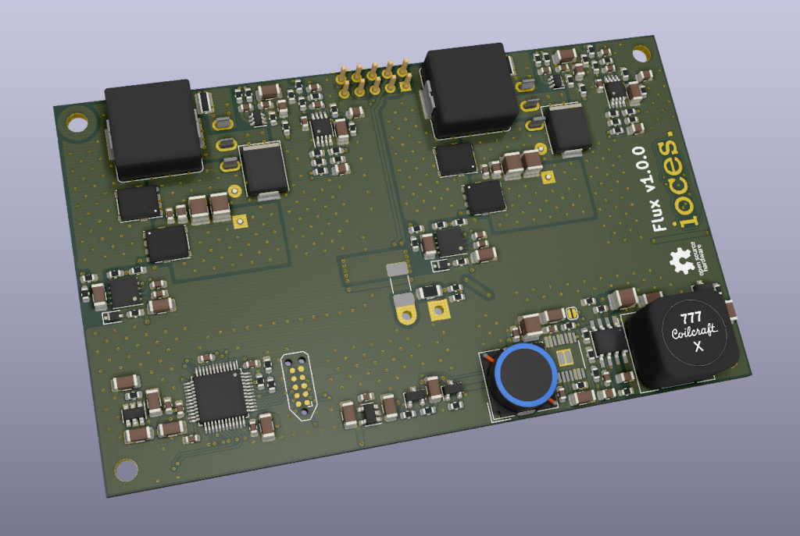
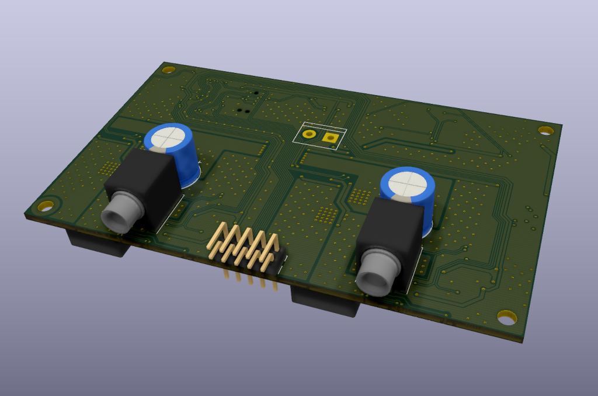

# Flux - a battery powered soldering station for Weller RT tips

This design is currently a work in progress, with the ultimate goal of being a portable soldering station utilising Weller RT tips. The design has two outputs, and will be powered off regular 18 or 36 V power tool lithium ion battery packs. It will support all RT tips from the RTP, RTM at RTU series.

## Current status

Flux is still a work in progress, and has just made it to the PCA prototyping stage:

- [x] Design
- [x] Schematic capture
- [x] PCB layout of v1.0.0
- [x] Prototype PCB/stencil ordered
- [ ] BOM generation
- [ ] Part ordering
- [ ] Documentation
- [ ] Prototype assembly
- [ ] Firmware development
- [ ] Prototype testing
- [ ] Enclosure design

## License

This project is licensed under two separate licenses. The hardware design and documentation for this project is licensed under the [CERN Open Hardware Licence Version 2 - Strongly Reciprocal](https://ohwr.org/cern_ohl_s_v2.txt) (CERN-OHL-S-2.0). The software and firmware source code for the project is licensed under the [GNU General Public License Version 3](https://www.gnu.org/licenses/gpl-3.0.txt) (GPL-3.0-only).

Further details can be found in the [license file](LICENSE.md).